# I Built a Fusion Agentic App by Typing One Paragraph. Here Is Exactly How.

### A step-by-step guide to the Oracle AI Agent Studio CLI, running inside Claude Code

---

Oracle released something in **26C** that is easy to miss and hard to un-see once you get it.

They put their own Fusion AI Agent Studio expertise into a public GitHub repo — as plain text files and a command-line tool. Any coding agent can read those files. Which means you can now describe a business outcome in a paragraph, and the agent will build the real Oracle app files for you.

Not a mockup. Not a chatbot demo. Actual `.app` and `.wf` files that Oracle Fusion validates and runs.

I ran the whole thing in **Claude Code**. This guide is every step, in order, with nothing skipped.

**The repo:** [github.com/oracle/fusion-ai-studio](https://github.com/oracle/fusion-ai-studio)

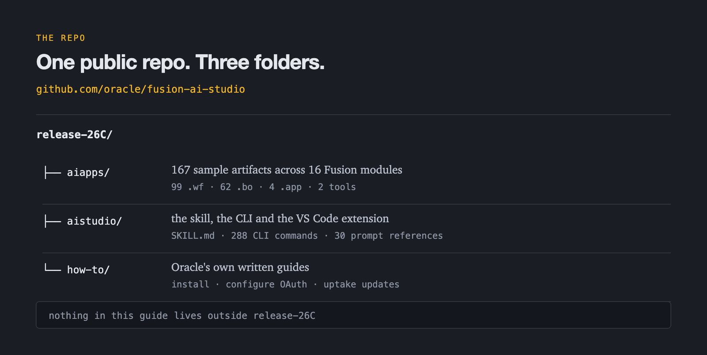

---

## Table of contents

1. [What this actually is](#1-what-this-actually-is)
2. [Who this is for](#2-who-this-is-for)
3. [The five rules that make this work](#3-the-five-rules-that-make-this-work)
4. [Before you start](#4-before-you-start)
5. [Step-by-step setup (Steps 1–10)](#5-step-by-step-setup)
6. [Your first build (Steps 11–16)](#6-your-first-build)
7. [Every skill and what it does](#7-every-skill-and-what-it-does)
8. [Slash commands for Oracle AI Agent Studio](#8-slash-commands-for-oracle-ai-agent-studio)
9. [The CLI command map (288 commands)](#9-the-cli-command-map)
10. [What you are actually building: agentic apps explained](#10-what-you-are-actually-building)
11. [Things that go wrong, and the fix](#11-things-that-go-wrong-and-the-fix)
12. [Keeping it up to date](#12-keeping-it-up-to-date)

---

## 1. What this actually is

Here is the whole idea in two pictures.

**On your machine**, a coding agent reads Oracle's expertise (written down as files) and uses Oracle's CLI to write app files:

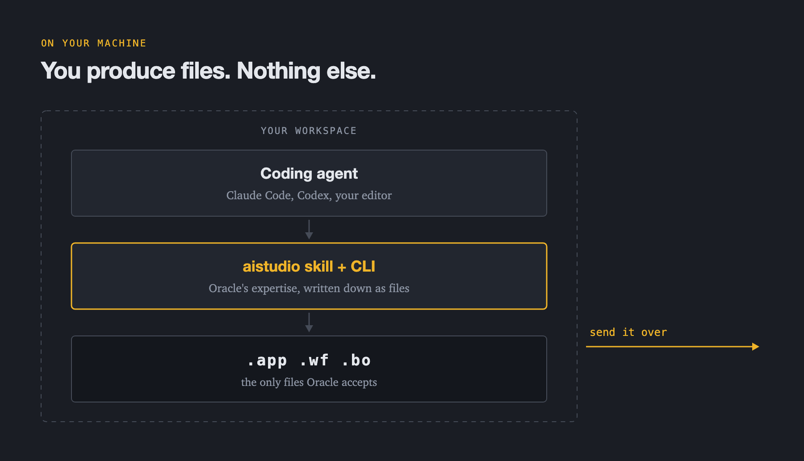

**Then you send those files to Oracle**, which checks every one of them before anything runs:

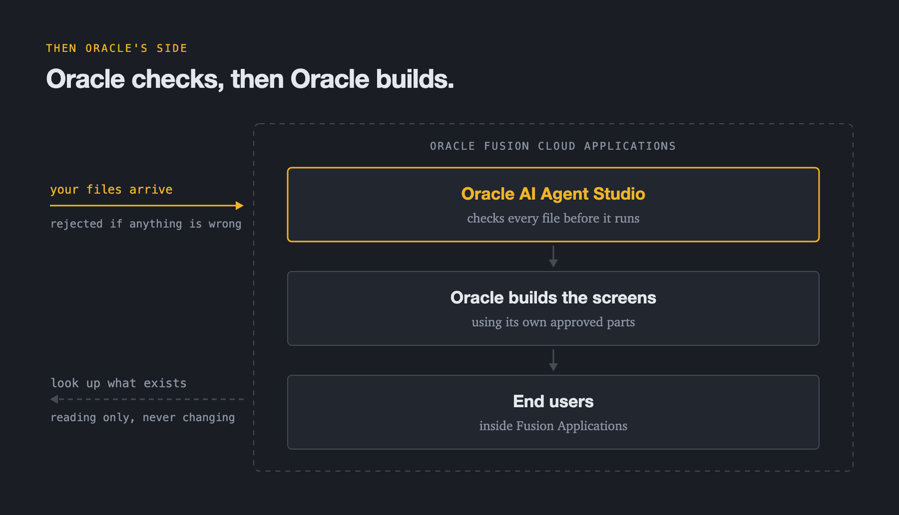

The important part is what the AI **does not** do. It never builds the screens. It never invents a widget. It never talks to your database.

It writes files. Oracle checks the files. Oracle builds the screens using its own approved parts. If a file is wrong, Oracle rejects it.

That single boundary is why this is safe enough to use on real HR and supply chain data.

### The four moving parts

| Part | What it is | Where it lives |
| --- | --- | --- |
| **The repo** | Oracle's public samples and tools | `github.com/oracle/fusion-ai-studio` |
| **The skill** | Oracle's know-how as markdown files an agent reads | `aistudio-skill.zip` |
| **The CLI** | 288 commands that create and check Oracle artifacts | `scripts/aistudio.js` inside the skill |
| **The VS Code extension** | Login, plus a visual editor for `.app` files | `aistudio-extension.zip` |

Oracle's own guide is written for **Codex**. Everything works the same in **Claude Code** — you just put the skill in one extra place. That one extra step is [Step 5](#step-5--make-claude-code-see-the-skills).

---

## 2. Who this is for

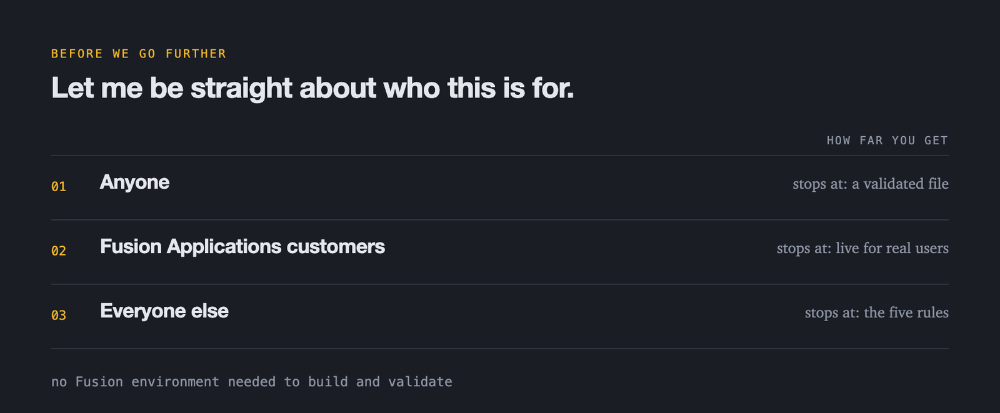

**Anyone.** Clone the repo, read the skills, run the CLI on your own laptop. Free. You can build and validate app files with no Fusion environment at all.

**Fusion Applications customers.** You can go all the way — publish and put the app in front of real users.

**Everyone else.** Stay for the five rules. They apply to any agent you build, on any platform.

---

## 3. The five rules that make this work

Oracle did not just ship a tool. They shipped a set of habits, baked into the skill files. This is the part worth stealing even if you never touch Fusion.

**Rule 1 — The spec comes first.**

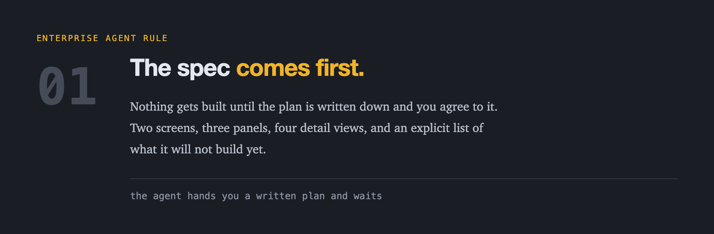

Nothing gets built until the plan is written down and you agree to it. Two screens, three panels, four detail views, and an explicit list of what it will *not* build yet.

At home we say "build me an HR app" and hope. Here the agent hands you a written plan and waits.

**Rule 2 — One gated write action.**

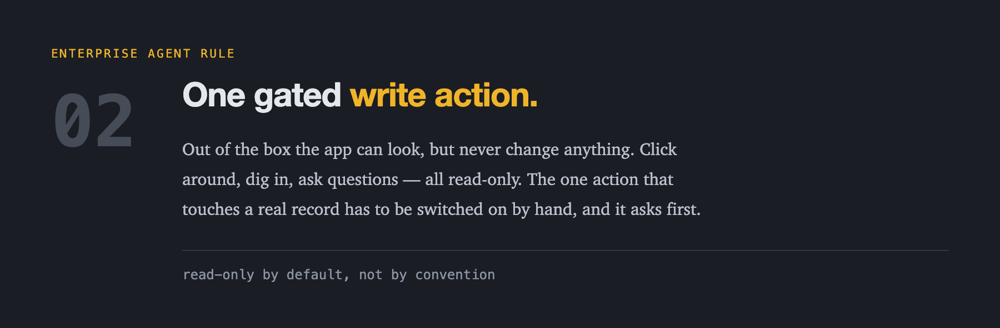

Out of the box the app can look, but never change anything. Click around, dig in, ask questions — all read-only. The one action that touches real HR data has to be switched on by hand, and it asks before it does anything.

**Rule 3 — Discover before you build.**

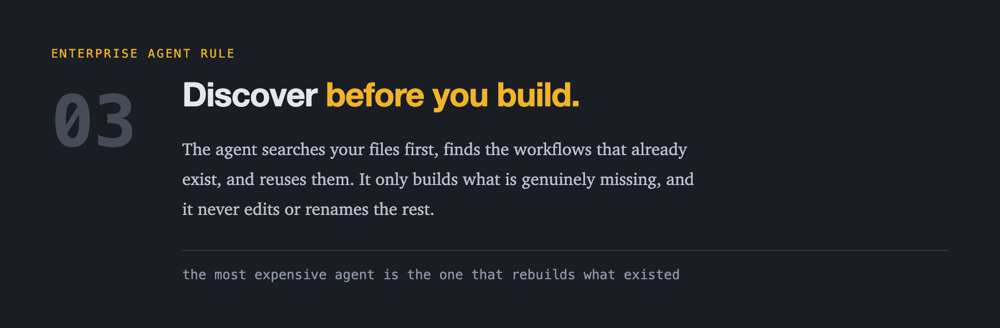

The agent searches your files first, finds the workflows that already exist, and reuses them. It only builds what is genuinely missing, and it never edits or renames the rest.

The most expensive agent in a big company is the one that rebuilds something that already existed.

**Rule 4 — Structure over improvisation.**

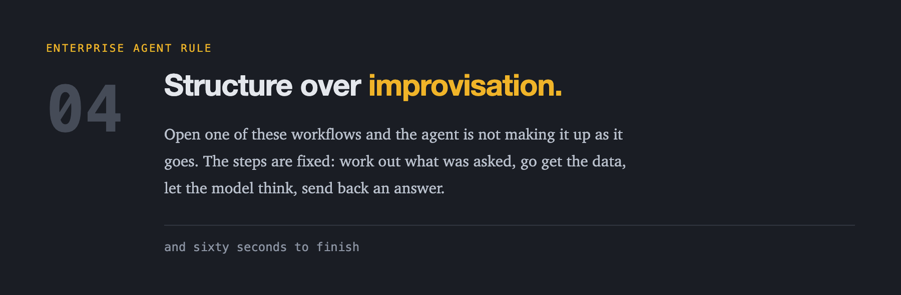

Open one of these workflows and the agent is not making it up as it goes. The steps are fixed: work out what was asked, go get the data, let the model think, send back an answer. And it has **sixty seconds** to finish.

**Rule 5 — Unvalidated means unfinished.**

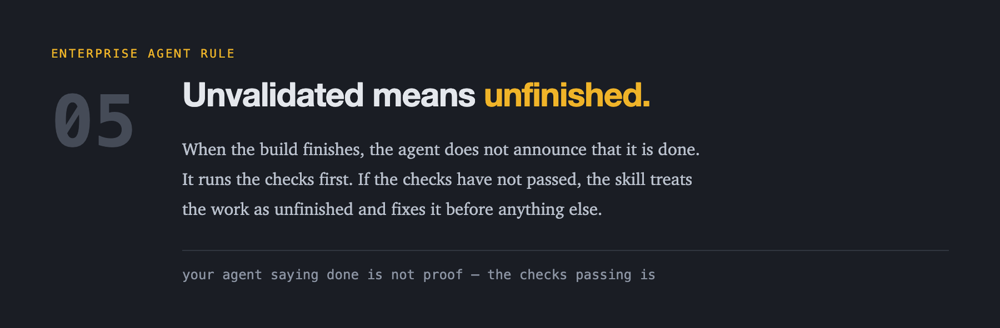

When the build finishes, the agent does not announce that it is done. It runs the checks first. If the checks have not passed, the skill treats the work as unfinished and fixes it before anything else.

Your agent saying "done" is not proof. The checks passing is.

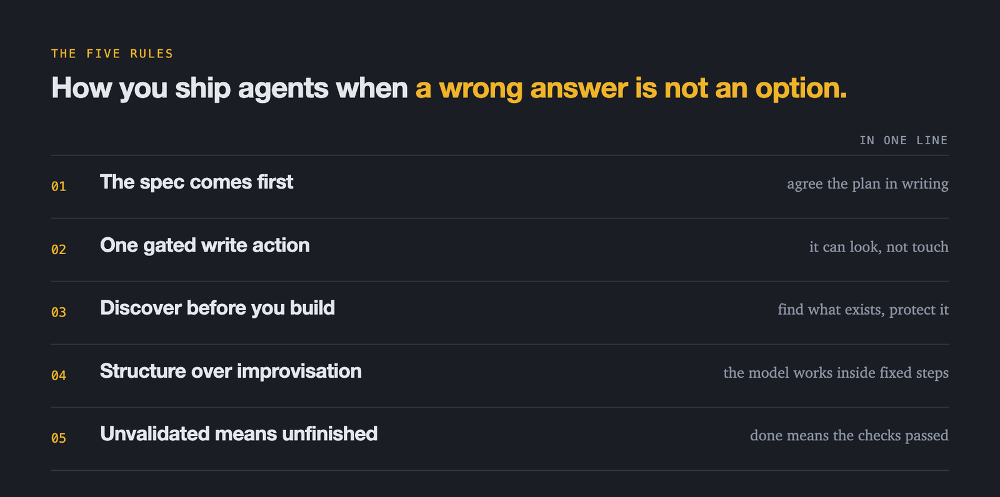

---

## 4. Before you start

Get these five things ready. It takes about ten minutes.

| # | What you need | How to check |
| --- | --- | --- |
| 1 | **Node.js** (v18 or newer) | Run `node --version` |
| 2 | **Git** | Run `git --version` |
| 3 | **VS Code** | [code.visualstudio.com](https://code.visualstudio.com/) |
| 4 | **Claude Code** | [claude.com/claude-code](https://claude.com/claude-code) — or the VS Code extension |
| 5 | **A Fusion environment URL + user** *(optional)* | Ask your Fusion admin |

**About #5:** you only need a Fusion environment when you want to fetch real business objects or publish the app. You can do the whole setup, build app files, and validate them with no environment at all. Start there if you are just exploring.

---

## 5. Step-by-step setup

### Step 1 — Get Oracle's repo

Make a folder called `fusion-ai-repo`, go into it, and clone:

```bash
mkdir -p ~/fusion-ai-repo
cd ~/fusion-ai-repo
git clone https://github.com/oracle/fusion-ai-studio.git
```

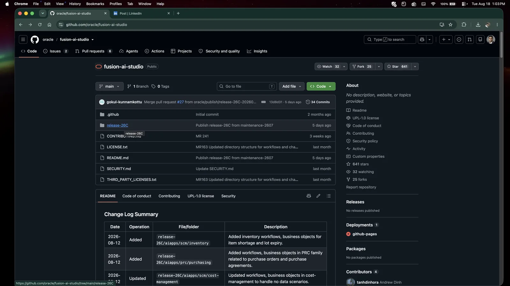

Everything in this guide lives under `release-26C`.

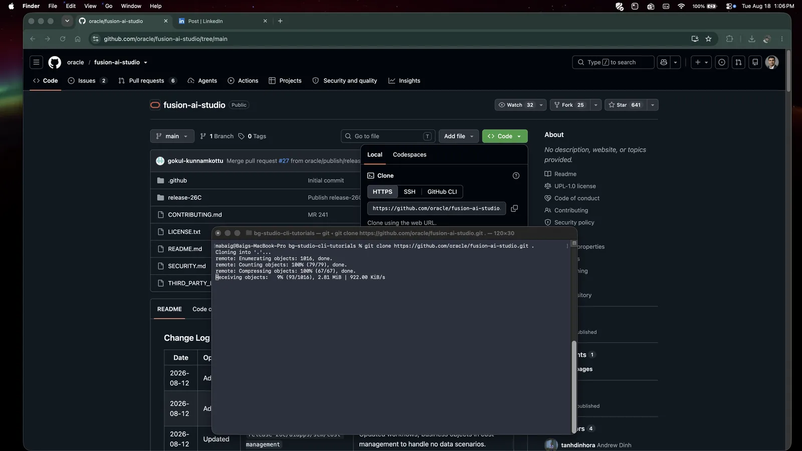

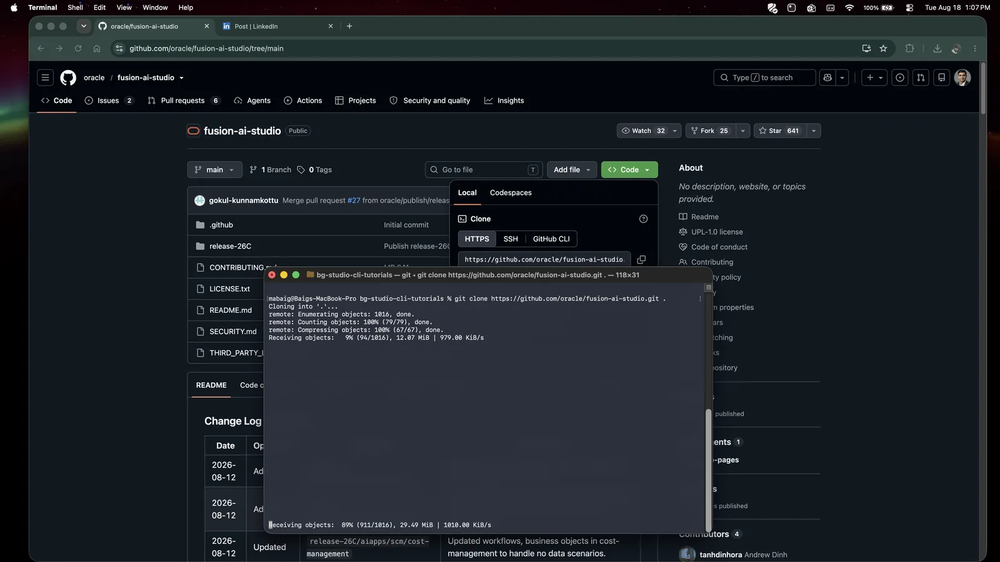

If you have already made the folder, clone into it with a trailing dot —
`git clone https://github.com/oracle/fusion-ai-studio.git .` — which is what the screenshots
above show.

Prefer not to use Git? On the GitHub page click **Code → Download ZIP**, then unzip it into `fusion-ai-repo`. Your folder will be called `fusion-ai-studio-main` instead of `fusion-ai-studio`. Everything else is identical — just remember which name you have.

You now have this:

```text
fusion-ai-repo/
└── fusion-ai-studio/
    └── release-26C/
        ├── aiapps/       ← 167 sample artifacts across 16 Fusion modules
        ├── aistudio/     ← the skill, the CLI, the extension
        └── how-to/       ← Oracle's own guides
```

What is in `aiapps` is worth knowing about, because the agent reuses it:

| Artifact type | Count |
| --- | --- |
| Workflows (`.wf`) | 99 |
| Business objects (`.bo`) | 62 |
| Apps (`.app`) | 4 |
| Deeplinks + tools | 2 |

Spread across 16 modules: HCM (absences, benefits, career development, compensation, employment, human resources, journeys, learning, recruiting, succession management, talent management, time and labour), SCM (inventory, maintenance, cost management), and FIN (ledger insights).

### Step 2 — Create your workspace folder

This is a **different folder** from the repo. The repo is where Oracle's stuff lives. The workspace is where *your* app lives.

```bash
mkdir -p ~/fusion-ai-workspace
cd ~/fusion-ai-workspace
```

Keeping them separate matters. When Oracle ships an update you replace things inside the repo and re-copy — and your own work in the workspace is never at risk.

### Step 3 — Install the VS Code extension

The extension gives you two things: a login flow, and a **visual editor** for `.app` files. You want both.

Go to the `bin` folder in the repo and unzip the extension:

```text
fusion-ai-repo/fusion-ai-studio/release-26C/aistudio/bin/
├── aistudio-extension.zip     ← unzip this
├── aistudio-extension.zip.sha256
├── aistudio-skill.zip         ← and this, in Step 4
└── aistudio-skill.zip.sha256
```

Double-click `aistudio-extension.zip` (macOS) or right-click → **Extract All** (Windows).
Inside you get one file: `aistudio-extension.vsix`.

Now install it. In VS Code:

1. Click the **Extensions** icon in the left bar (the stacked squares)
2. Click the **`...`** menu at the top of the Extensions panel
3. Choose **Install from VSIX...**

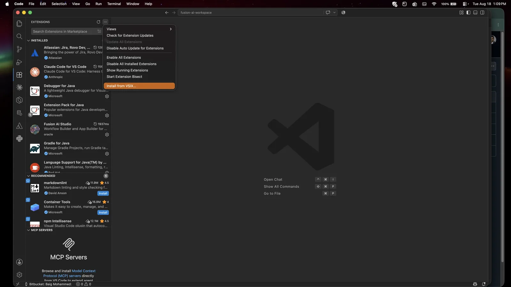

4. Pick `aistudio-extension.vsix` and click **Install**

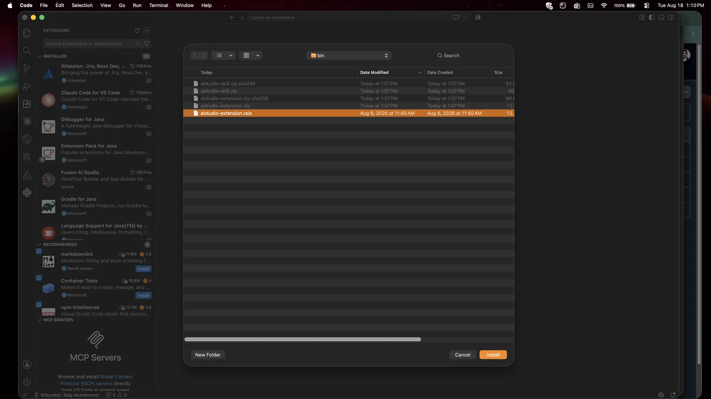

5. Reload VS Code if it asks

That file picker is also a good look at the `bin` folder: both zips, both checksums, and the `.vsix`
you just unpacked, all in one place.

**Check it worked.** Press `Cmd+Shift+P` (macOS) or `Ctrl+Shift+P` (Windows/Linux) and type
`Fusion AI Studio`. You should see a list of commands:

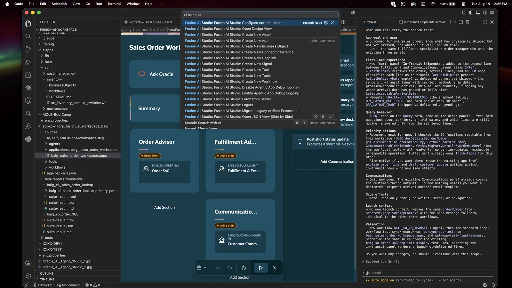

Here is the full set and what each one is for:

| Command | Use it for |
| --- | --- |
| `Configure Authentication` | Connect VS Code to your Fusion environment |
| `Fetch from Server` | Pull an existing artifact down into your workspace |
| `Create New App` | A user-facing workspace with panels, actions and agents |
| `Create New Workflow` | A step-by-step flow that calls AI, services, code or approvals |
| `Create New Business Object` | A reusable data connection to Fusion or another service |
| `Create New Agent` | A reusable AI worker with a role, tools and instructions |
| `Create New Tool` | A capability for an agent: business object, deeplink, REST, connector |
| `Create New Connector Instance` | A configured connection to an approved external system |
| `Create New Deeplink` | A link that opens a target page or record |
| `Create New Topic` | Instructions guiding an agent on one subject |
| `Enable / Disable Agentic App Debug Logging` | Turn detailed app logs on or off |
| `Logout` | Sign out of the environment |

If nothing appears, reload VS Code and try again. Still nothing — reinstall the `.vsix`.

### Step 4 — Install the aistudio skill

This is the important one. The skill is Oracle's expertise written down so an agent can read it.

Unzip `aistudio-skill.zip` from the same `bin` folder. You get a folder called `aistudio` containing `SKILL.md`, `scripts/`, `references/` and `resources/`.

Create the folder structure in your workspace and copy it in:

```bash
cd ~/fusion-ai-workspace
mkdir -p .agents/skills
cp -R ~/fusion-ai-repo/fusion-ai-studio/release-26C/aistudio/bin/aistudio-skill/aistudio .agents/skills/
```

Now do the same for the **app skills** — the domain-specific guides. They are in a different folder:

```bash
cd ~/fusion-ai-repo/fusion-ai-studio/release-26C/aistudio/aistudio-apps-skills
unzip aistudio-apps-skills.zip
cp -R aistudio-apps-skills/* ~/fusion-ai-workspace/.agents/skills/
```

You should end up with exactly this:

```text
fusion-ai-workspace/
└── .agents/
    └── skills/
        ├── aistudio/                                      ← the base skill + CLI
        │   ├── SKILL.md
        │   ├── scripts/aistudio.js
        │   ├── references/prompts/                        ← 30 prompt files
        │   │   └── workflow-node-prompts/                 ← 27 node prompt files
        │   └── resources/app-samples/
        ├── aistudio-apps-succession-management/           ← HCM domain skill
        └── aistudio-apps-warehouse-operations-shortages/  ← SCM domain skill
```

Here is a domain skill handing work back to the base skill — this is exactly how they are designed to cooperate:

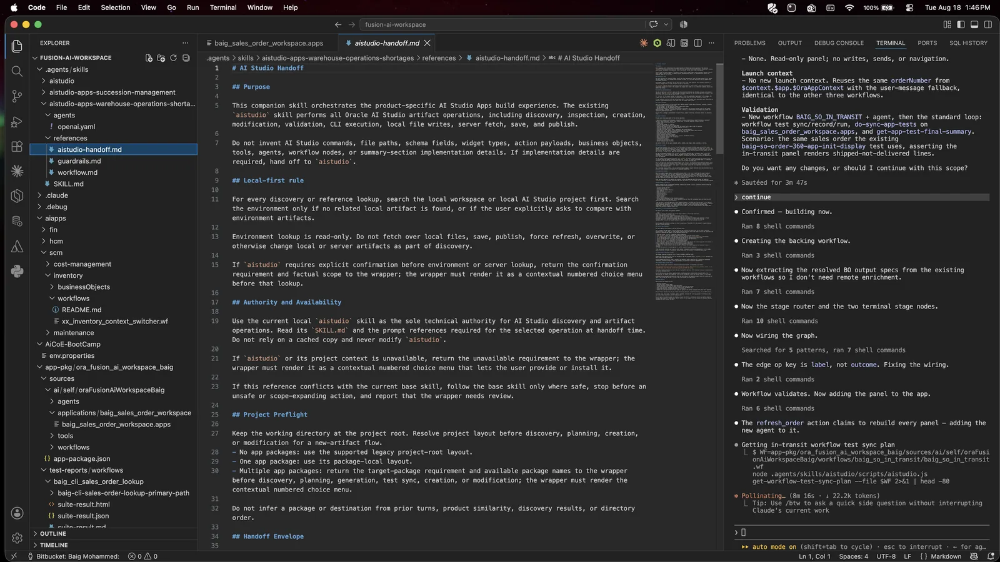

### Step 5 — Make Claude Code see the skills

**This is the Claude Code-specific step, and it is the one Oracle's guide does not cover.**

Oracle's guide puts skills in `.agents/skills/`. That is where **Codex** looks. **Claude Code** looks in `.claude/skills/`.

You do not want two copies. Keep the real files in `.agents/skills/` (so the CLI paths in every Oracle prompt still work) and point `.claude/skills/` at them.

**macOS and Linux — use symlinks:**

```bash
cd ~/fusion-ai-workspace
mkdir -p .claude/skills
cd .claude/skills
ln -s ../../.agents/skills/aistudio aistudio
ln -s ../../.agents/skills/aistudio-apps-succession-management aistudio-apps-succession-management
ln -s ../../.agents/skills/aistudio-apps-warehouse-operations-shortages aistudio-apps-warehouse-operations-shortages
```

Check it:

```bash
ls -la ~/fusion-ai-workspace/.claude/skills
```

You should see three arrows pointing back into `.agents/skills`.

**Windows — just copy instead.** Symlinks on Windows need Developer Mode or an admin shell, so save yourself the trouble:

```powershell
cd $HOME\fusion-ai-workspace
New-Item -ItemType Directory -Force .claude\skills
Copy-Item -Recurse .agents\skills\* .claude\skills\
```

The trade-off: if you copy, you have to re-copy whenever Oracle ships a skill update. Symlinks update themselves.

**Why keep `.agents/skills/` as the real home?** Because every Oracle prompt, every example, and the skill's own instructions all say to run the CLI as `node .agents/skills/aistudio/scripts/aistudio.js`. With this layout that path is always correct, and both Claude Code and Codex work in the same workspace.

### Step 6 — Copy the sample apps

Copy Oracle's samples into your workspace so the agent can find and reuse them:

```bash
cp -R ~/fusion-ai-repo/fusion-ai-studio/release-26C/aiapps ~/fusion-ai-workspace/
```

Do not skip this. Rule 3 is "discover before you build" — and this folder is what there is to discover. Skip it and the agent has nothing to reuse, so it builds everything from scratch.

### Step 7 — Connect to your Fusion environment

Open your workspace in VS Code (**File → Open Folder →** `fusion-ai-workspace`), then press `Cmd+Shift+P` / `Ctrl+Shift+P` and run **`Fusion AI Studio: Configure Authentication`**.

You get two choices.

**Basic Authentication** — fine for dev and test environments. Three prompts:

1. **Environment URL.** Must end in `.com` with no extra path. So `https://your-env.fa.us2.oraclecloud.com`, not `https://your-env.fa.us2.oraclecloud.com/fscmUI/...`
2. **Username**
3. **Password** — stored encrypted in `env.properties`, with the encryption key in your OS keychain

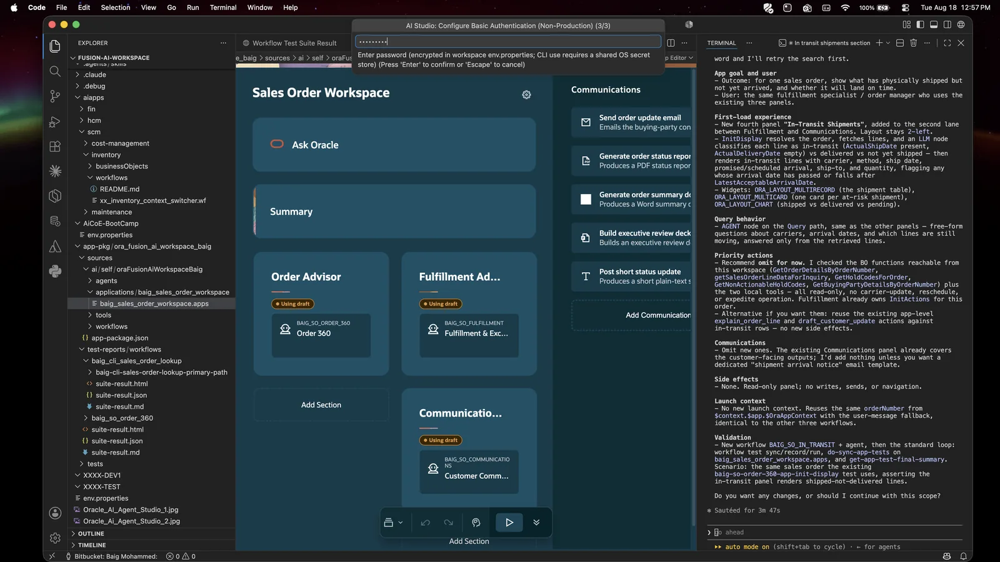

Note the wording on that last prompt: *encrypted in workspace env.properties; CLI use requires a
shared OS secret store*. The password never lands anywhere in plain text.

**OAuth / Token Authentication** — required for production. This one is a two-place job: register a
public client in Oracle IDCS, then register its Application ID back in AI Agent Studio.

**In IDCS — Integrated applications → Add application → Mobile Application.** Save it, open the
**OAuth configuration** tab, and click **Edit OAuth configuration**:

- Allowed grant types: **Authorization code**, **Refresh token**, **Implicit**. Leave Device code off.
- Turn on **Allow non-HTTPS URLs**
- Redirect URLs: `http://127.0.0.1:43188/callback` and `urn:ietf:wg:oauth:2.0:oob`
- Logout and post-logout redirect URL: `http://127.0.0.1:43188/logout`
- Leave **Bypass consent** off

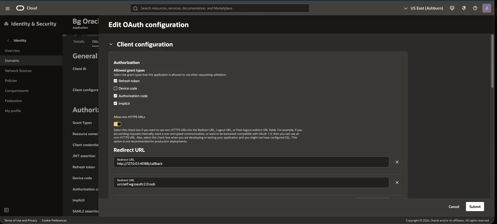

Further down the same panel, under **Token issuance policy**, turn on **Add resources** and grant
the scopes for **Oracle Fusion AI Cloud (Spectra)** and **Oracle Boss Cloud (Spectra)**:

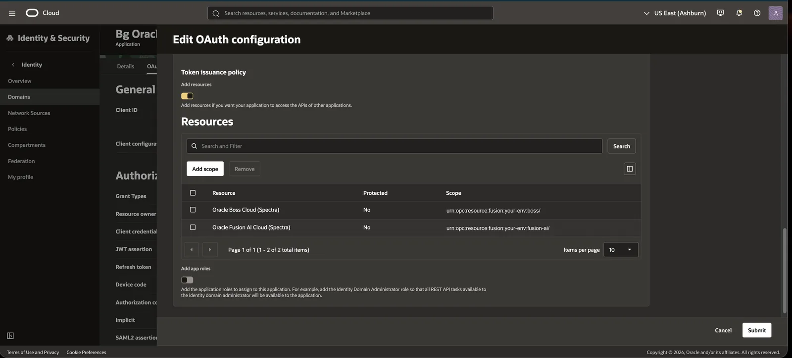

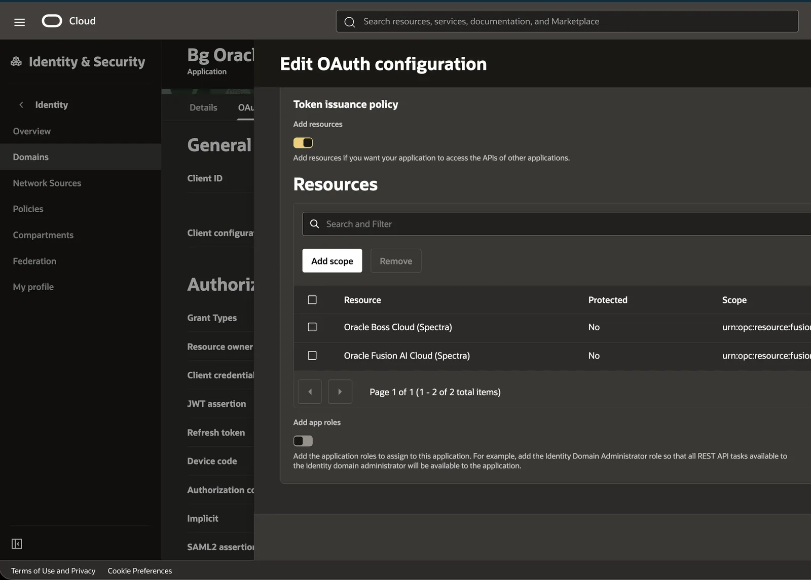

Both scopes carry your environment name — `urn:opc:resource:fusion:<your-env>:fusion-ai/` and
`urn:opc:resource:fusion:<your-env>:boss/`. Leave **Add app roles** off.

**Then in AI Agent Studio — Credentials → AI Studio CLI → Enable AI Studio CLI.** The page spells
out the same nine steps and gives you the field to paste the generated **Application ID** into:

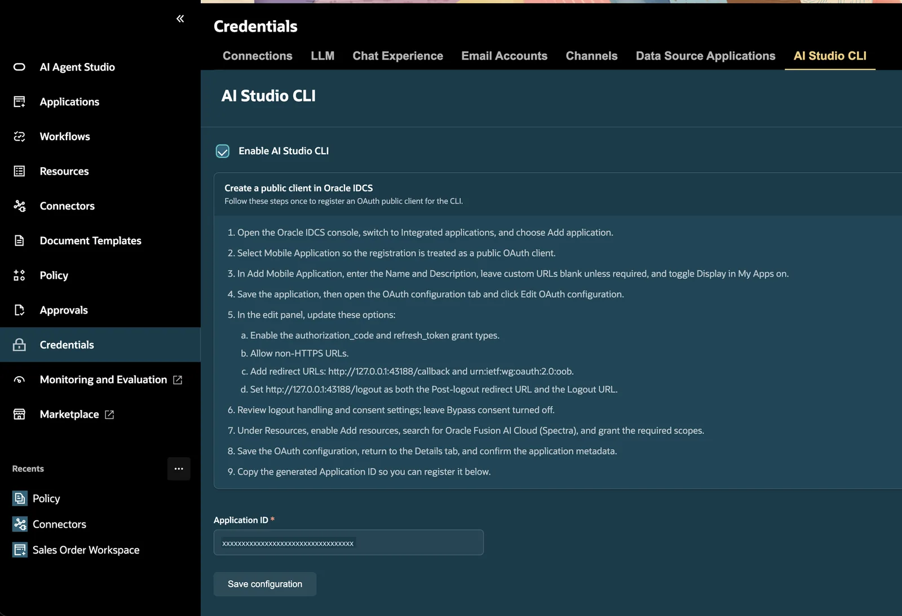

**Heads up on the naming.** That field is labelled **Application ID**, and Oracle's step 9 on the
same page says to paste the generated Application ID. Oracle's *written* how-to
(`how-to-configure-oauth-for-aistudio-cli.md`) talks about the **Client ID** from the OAuth
configuration tab instead. If `authenticate` later fails, that mismatch is the first thing to check.

Save it, and the page hands you the finished `env.properties` — with a copy button:

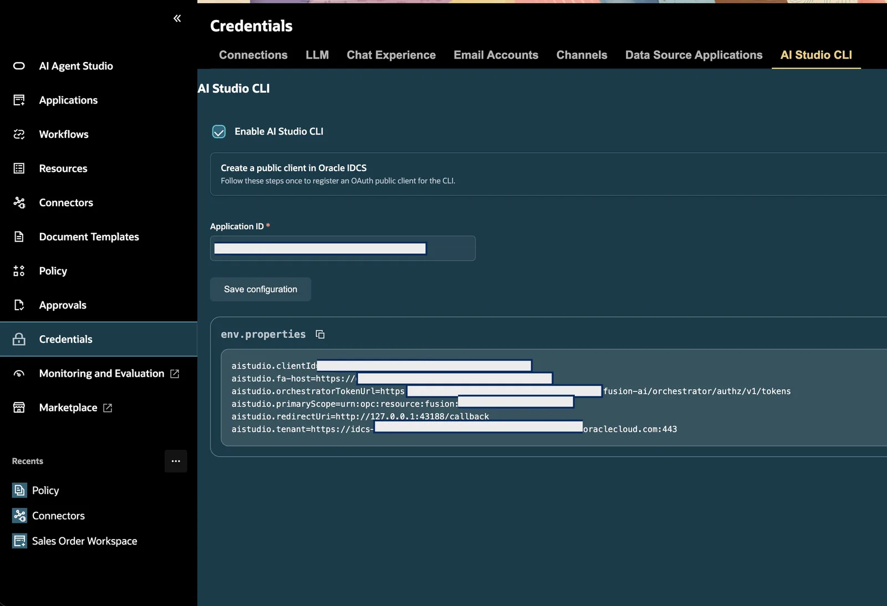

Copy that into `env.properties` in your workspace root, then sign in from the terminal:

```bash
node .agents/skills/aistudio/scripts/aistudio.js authenticate
```

A browser opens. Sign in. Come back.

Full details are in Oracle's `release-26C/how-to/how-to-configure-oauth-for-aistudio-cli.md`.

**Either way, you end up with an `env.properties` file in your workspace root.** It looks like this:

```properties
aistudio.clientId=<your client id>
aistudio.fa-host=<your environment host>
aistudio.orchestratorTokenUrl=<token url>
aistudio.primaryScope=<scope>
aistudio.redirectUri=http://127.0.0.1:43188/callback
aistudio.tenant=<tenant>
aistudio.dev-mode=<true|false>
```

### Step 8 — Protect your secrets

Do this now, before you forget. Create a `.gitignore` in your workspace:

```gitignore
env.properties
.debug/
```

`env.properties` holds your environment host, client ID and encrypted password. It does not belong in a shared repo. `.debug/` holds recorded test data from real runs, which can contain live business data.

### Step 9 — Check the CLI works

From your workspace root:

```bash
node .agents/skills/aistudio/scripts/aistudio.js --help
```

You should get a wall of commands — 288 of them. Two more quick checks:

```bash
# what version am I on?
node .agents/skills/aistudio/scripts/aistudio.js version

# who am I signed in as? (needs auth)
node .agents/skills/aistudio/scripts/aistudio.js whoami
```

**Three rules for running the CLI, and they matter:**

1. **Always run it from the workspace root.** Never `cd` into the skill folder.
2. **Always call it by full path.** There is no global `aistudio` command to install. When Oracle's prompts show `aistudio <command>`, that is shorthand for `node .agents/skills/aistudio/scripts/aistudio.js <command>`.
3. **Never use `npm run` or `npm test`** to run workflow tests. Those scripts are for CI pipelines. Call the CLI directly.

### Step 10 — Add a CLAUDE.md

Optional, but it saves you a lot of repetition. Create `CLAUDE.md` in your workspace root:

```markdown
# Oracle AI Agent Studio workspace

## How to run the CLI
- Always run from the workspace root. Never `cd` into the skill folder.
- Always invoke by path: `node .agents/skills/aistudio/scripts/aistudio.js <command> ...`
- There is no global `aistudio` binary. Do not run `which aistudio` or try to install one.
- Never use `npm run` or `npm test` for workflow or app tests.

## Skills
- Use the `aistudio` skill for all artifact work (apps, workflows, business objects,
  tools, agents, topics, connectors, approvals, policies, document schemas, functions).
- Use `aistudio-apps-succession-management` for HCM succession apps.
- Use `aistudio-apps-warehouse-operations-shortages` for SCM warehouse and shortage apps.

## Hard rules
- Do NOT run `init` unless I explicitly ask to scaffold a blank project.
- Discover and reuse before creating. Treat every existing artifact as read-only.
- Keep everything local. Only fetch, save, publish or push when I explicitly ask.
- Never publish a workflow from the CLI.
- After a material edit, run the matching `validate-*` command. Unvalidated means unfinished.
- Never write a raw password into env.properties, command arguments, files or logs.

## Layout
- Local artifacts: `src/<type>/` (workflows, apps, agents, businessObjects, tools, ...)
- Oracle samples to reuse: `aiapps/`
- Secrets: `env.properties` (git-ignored)
```

---

## 6. Your first build

Now the fun part. Open a terminal in your workspace and start Claude Code:

```bash
cd ~/fusion-ai-workspace
claude
```

### Step 11 — Describe the outcome

Do not describe screens. Describe the business problem. This is the shape of prompt that works:

```text
Design and build a Sales Order Workspace agentic app for the fulfilment
specialist who owns a single sales order end to end.

The app should give one order's full picture — order 360, what has shipped
and what has not, which lines are at risk of missing their date — explain
why each exception matters, and let the specialist send the customer-facing
updates that follow from it.
```

Notice what is *not* in there: no panel names, no widget types, no file names, no field names. That
is the point. The skill knows how an order-management workspace is supposed to be shaped.

> **A note on names.** In the screenshots below, the package, workspace and artifact names are mine.
> Yours will be different. Everything else — the sequence, the gates, the wording the skill uses — is
> the same.

### Step 12 — The agent writes the spec, then stops

This is Rule 1, and it is the most important screenshot in this guide. Below is the gate from the run
where I added a fourth panel — **In-Transit Shipments** — to a finished app. Same behaviour on the
first build, and on every change after it:

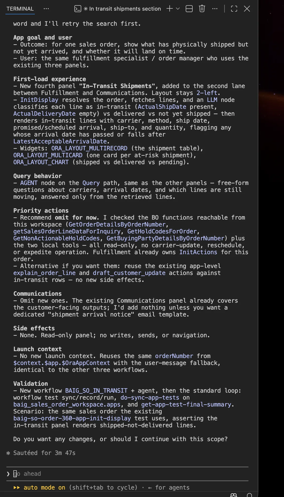

Read what it commits to before writing anything:

- **App goal and user** — *"for one sales order, show what has physically shipped but not yet
  arrived, and whether it will land on time"*, for *"the same fulfillment specialist / order manager
  who uses the existing three panels"*
- **First-load experience** — which panel, which lane, which layout, which widgets
  (`ORA_LAYOUT_MULTIRECORD`, `ORA_LAYOUT_MULTICARD`, `ORA_LAYOUT_CHART`)
- **Priority actions** — *"Recommend omit for now"*, with the list of business-object functions it
  checked before deciding
- **Communications** — *"Omit new ones. The existing Communications panel already covers the
  customer-facing outputs"*
- **Side effects** — *"None. Read-only panel; no writes, sends, or navigation."* That is Rule 2, in
  writing, before the build
- **Validation** — the exact test loop it will run afterwards, named command by named command

And then the last line: *"Do you want any changes, or should I continue with this scope?"* It stops
there. Nothing has been created, changed, fetched, saved or published.

### Step 13 — Discovery, and protected reuse

Look at two of those decisions again. It omitted new priority actions *because it had already checked
what existed*, and it omitted new communications *because the existing panel already covered them*.
That is Rule 3, and it is not a habit the model happens to have — it is written into the skill. The
same handoff document from [Step 4](#step-4--install-the-aistudio-skill) spells it out:

> **Local-first rule.** For every discovery or reference lookup, search the local workspace or local
> AI Studio project first. Search the environment only if no related local artifact is found, or if
> the user explicitly asks to compare with environment artifacts.
>
> Environment lookup is read-only. Do not fetch over local files, save, publish, force refresh,
> overwrite, or otherwise change local or server artifacts as part of discovery.

The most expensive agent in a big company is the one that rebuilds something that already existed.
This one is told, in writing, not to be that.

### Step 14 — Files, then checks

Say continue, and it builds — narrating each step and running the CLI, not inventing file contents:

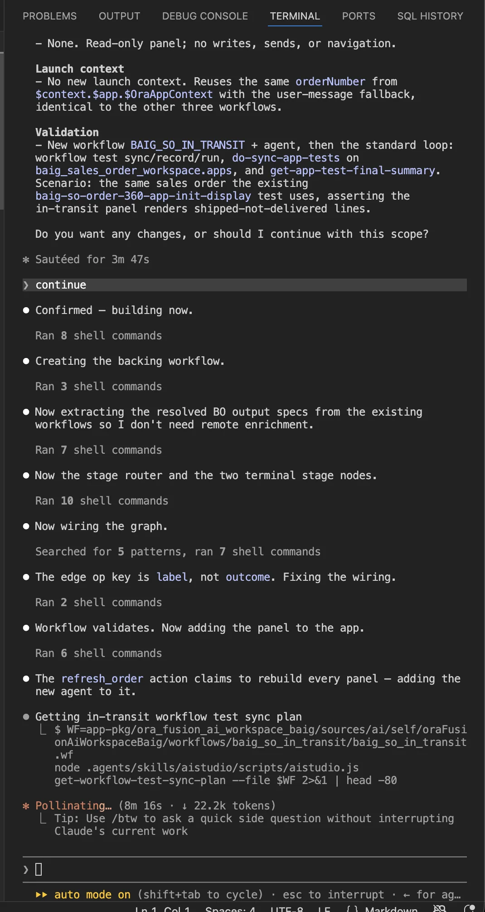

The order of those lines is the whole discipline:

```text
Confirmed — building now.
Creating the backing workflow.
Now extracting the resolved BO output specs from the existing workflows
  so I don't need remote enrichment.        ← reuse, not re-fetch
Now the stage router and the two terminal stage nodes.
Now wiring the graph.
The edge op key is label, not outcome. Fixing the wiring.    ← caught by validation
Workflow validates. Now adding the panel to the app.
```

It validated the workflow **before** attaching it to the app, found its own wiring mistake, and
fixed it. Then it went into the test loop it promised in Step 12 — `get-workflow-test-sync-plan`,
then `do-sync-app-tests`, then `get-app-test-final-summary`. That is Rule 5: the agent does not get
to say "done", the checks do.

Your workspace now holds real artifacts, in Oracle's app-package layout:

```text
app-pkg/<your-package>/sources/ai/self/<YourWorkspace>/
├── applications/<app>/
│   └── <app>.apps
├── workflows/
│   ├── so_order_360/
│   ├── so_fulfillment/
│   ├── so_communications/
│   └── so_in_transit/
├── agents/
└── tools/
test-reports/workflows/               ← suite-result.html / .json / .md
```

### Step 15 — Open it in the visual editors

Click a `.wf` file and the extension opens the real workflow editor. This is Rule 4 made visible —
the steps are fixed, and the model only fills the slots inside them:

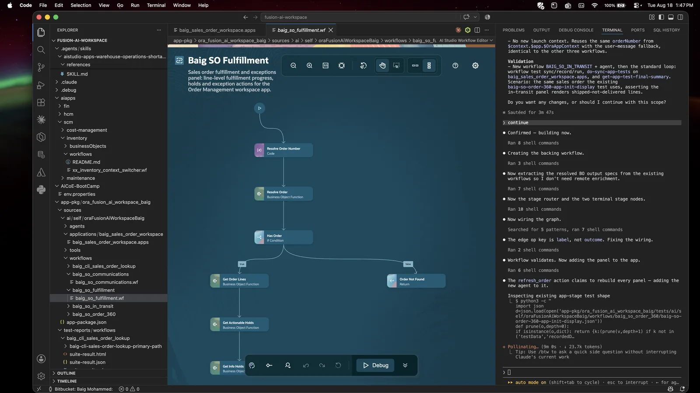

Resolve the order number → resolve the order → *has order?* → get the lines, or return **Order Not
Found** → get actionable holds → get info holds. No improvisation, and sixty seconds to finish.

Click a `.apps` file and you get the app editor — the same one that exists in the Fusion UI:

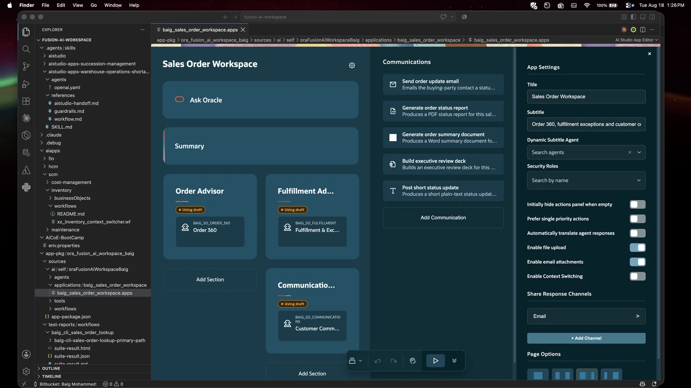

Title, Subtitle, Dynamic Subtitle Agent, Security Roles, the panel layout, and the switches for file
upload, email attachments and context switching. Edit here or edit through the agent; both write the
same file.

If you see **"This app has been modified on the server"**, someone changed the server copy. Pick
**Refresh from Server** to take theirs, or **Cancel** to think about it. Do not reach for **Override
Server** unless you are certain.

### Step 16 — Save it, then look at it

Everything up to here is **local**. Nothing has touched your Fusion environment. Save the app as a
remote draft (the commands are in the next section) and it appears in AI Agent Studio under
**Applications** — as a **Draft**, not live:

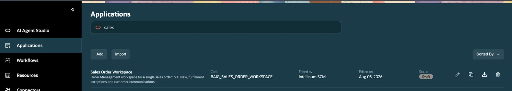

And here it is running, from one paragraph of plain English:

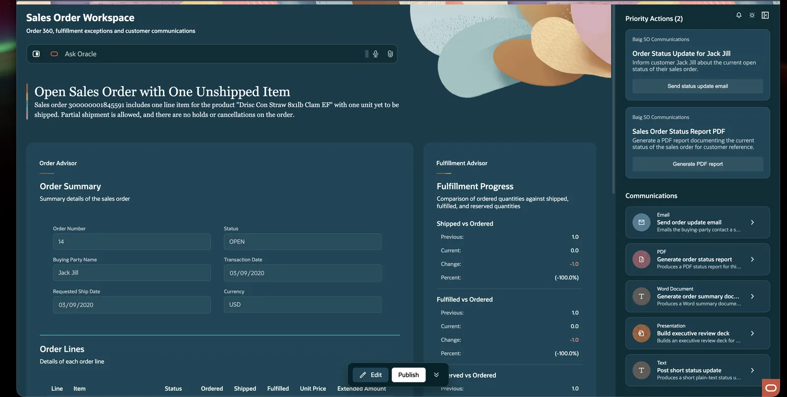

One order. An **Order Advisor** panel with the 360 view, a **Fulfillment Advisor** panel with
shipped-versus-ordered progress and the exceptions behind it, a **Communications** panel with five
outbound formats, two **Priority Actions** the agent raised on its own, and **Ask Oracle** across the
top for anything the panels do not already answer.

Nothing on that screen changed a record. Every write is an action a human has to press.


### Saving and publishing

These are the two commands behind Step 16:

```bash
# save an app as a remote draft
node .agents/skills/aistudio/scripts/aistudio.js do-save-app \
  --file app-pkg/<your-package>/sources/ai/self/<YourWorkspace>/applications/<app>/<app>.apps

# pull the server's version down instead
node .agents/skills/aistudio/scripts/aistudio.js do-fetch-app --code <YOUR_APP_CODE>
```

On a plain (non-package) workspace the file path is simply `src/apps/<app>.app`.

**One hard limit worth knowing:** you cannot publish a workflow from the CLI. That is deliberate. Publishing a workflow makes it live for real users, and Oracle keeps that as a human decision in the Fusion UI. The skill is explicitly told not to work around it.

---

## 7. Every skill and what it does

### The three skills you install

| Skill | Slash command | What it is for |
| --- | --- | --- |
| **`aistudio`** | `/aistudio` | The base skill. Handles every artifact type — apps, workflows, business objects, tools, agents, topics, deeplinks, connectors, approvals, policies, document schemas, functions. Routes your request, loads the right reference, runs the CLI. **This is the one that does the actual work.** |
| **`aistudio-apps-succession-management`** | `/aistudio-apps-succession-management` | A guided companion for HCM succession apps. Knows what a succession readiness workspace should contain, walks you through scope, and hands all file operations to `aistudio`. New artifacts get the `SP_` prefix. |
| **`aistudio-apps-warehouse-operations-shortages`** | `/aistudio-apps-warehouse-operations-shortages` | The same idea for SCM. Warehouse operations, shortages, stockouts, delayed outbound demand, inbound exceptions, tasking. New artifacts get the `WO_` prefix. |

**How the two layers relate.** The domain skills are wrappers. They handle the conversation — what should this app contain, which panels, what is in scope. They never create a file themselves. Every file operation goes down to `aistudio`. That is why they can be beginner-friendly without being unsafe.

You usually do not need to type a slash command at all. Say "build a succession planning app" and the right skill loads on its own. Type `/aistudio` when you want to force it, or when your request is generic enough that the agent might not spot it.

### What the domain skills guarantee

Both follow the same contract, and it is a good one:

- **A structured welcome** before anything happens — business purpose, recommended MVP, what is deliberately deferred, how it will be built
- **Exactly one option marked "Recommended"** at every decision
- **A pause after every gate.** No forward motion without your choice
- **A written proposal** before any file is created
- **Every discovered artifact treated as read-only.** Never modified, renamed, deleted or overwritten
- **Validation of only the files this run created.** Not directories, not globs, not siblings
- **A "Stop" option** at every step that leaves nothing changed

One difference worth knowing: the succession skill searches **your local workspace first**, then the environment. The warehouse skill searches the **connected environment first**, then falls back to local. That is because warehouse artifacts ship seeded in Fusion, while succession samples ship in the GitHub repo.

### Inside `aistudio`: the 30 prompt reference files

The base skill stays short on purpose. The detail lives in `references/prompts/`, and the agent loads only what the task needs — that is what keeps it fast.

**Workflows**

| File | What it covers |
| --- | --- |
| `workflow-vibe.md` | The main workflow authoring guide |
| `workflow-debug.md` | Debugging a workflow that misbehaves |
| `workflow-debug-plan.md` | Plan-mode debugging |
| `workflow-test-authoring.md` | Generating, recording, running, judging and self-healing workflow tests. Also model cost and token optimisation. |
| `workflow-cli-compat.md` | Which CLI command matches which workflow operation |

**Agentic apps**

| File | What it covers |
| --- | --- |
| `app-ingestion.md` | The intake questions to ask before starting a new app |
| `app-best-practices.md` | App structure, workflow contracts, widgets, actions, communications, validation |
| `app-vibe-master.md` | The main app authoring guide |
| `app-vibe-plan.md` | Plan-mode app design |
| `app-vibe-actions.md` | Building app actions |
| `app-vibe-templates.md` | Document templates — PowerPoint, PDF, email, text |
| `app-vibe-widgets.md` | Choosing and configuring the seven widget types |
| `app-test-authoring.md` | App test generation, recording, widget validation, self-healing |

**Data and tools**

| File | What it covers |
| --- | --- |
| `business-object-builder.md` | Building business objects — your data connections |
| `business-object-cli-compat.md` | Business object CLI parity |
| `tools-builder.md` | Building tools: business object, deeplink, document, email, external REST, MCP, connector |
| `tools-cli-compat.md` | Tool CLI parity |
| `connector-definition-cli-compat.md` | Generating connector definitions from OpenAPI or MCP specs |
| `connector-instance-cli-compat.md` | Configuring connector instances |

**Governance and documents**

| File | What it covers |
| --- | --- |
| `approval-process-builder.md` | Approval processes, levels, approver types, notification channels |
| `approval-process-cli-compat.md` | Approval CLI parity |
| `policy-store-builder.md` | Policy stores — turning policy documents into callable functions |
| `policy-store-cli-compat.md` | Policy CLI parity |
| `document-schema-builder.md` | Document schemas for structured extraction |
| `document-schema-cli-compat.md` | Document schema CLI parity |
| `function-builder.md` | Reusable function templates |
| `function-cli-compat.md` | Function CLI parity |

**General**

| File | What it covers |
| --- | --- |
| `index.md` | The map of all of the above |
| `artifact-conventions.md` | File paths, extension mapping, normalised file shape |

### The 27 workflow node prompt files

Every node type in a workflow graph has its own rule file, in `references/prompts/workflow-node-prompts/`:

| Group | Node prompt files |
| --- | --- |
| **Structure** | `start-end`, `return`, `reference`, `reference-block`, `comment-diagram-only` |
| **AI** | `llm`, `agent`, `rag-document-tool` |
| **Logic** | `code`, `set-variables`, `if-condition`, `switch`, `for-loop`, `while-loop`, `parallel`, `wait` |
| **Data** | `bo-function`, `external-rest`, `tool`, `document-processor`, `vector-db-reader`, `vector-db-writer` |
| **People** | `human-approval`, `email` |
| **Composition** | `workflow` (calling one workflow from another) |

You will never read these yourself. The agent reads the two or three it needs and ignores the rest.

### The artifacts you can create

| Artifact | Extension | In plain language |
| --- | --- | --- |
| App | `.app` | The screen a business user opens |
| Workflow | `.wf` | The step-by-step plan behind a panel |
| Business Object | `.bo` | A connection to real data |
| Agent | `.agent` | A reusable AI worker with a role and tools |
| Tool | `.tool` | One capability an agent can use |
| Topic | `.topic` | Instructions for one subject area |
| Deeplink | `.dl` | A link that opens a Fusion page or record |
| Connector Definition | `.connectorDefinition` | A connector generated from an API spec |
| Connector Instance | `.connectorInstance` | A configured external connection |
| Approval Process | `.approval` | Who approves what, and how they are told |
| Policy Store | `.policy` | Policy documents turned into callable functions |
| Policy Template | `.policyTemplate` | A reusable policy function contract |
| Document Schema | `.documentSchema` | The shape to pull out of a document |
| Function Template | `.function` | A reusable code function |

They live under `src/<type>/` in a plain workspace, or inside `app-pkg/<package>/sources/` if you use app packages.

---

## 8. Slash commands for Oracle AI Agent Studio

Worth being precise here, because it trips people up.

**Oracle does not ship slash commands.** It ships *skills*. Claude Code turns every skill into a slash command automatically, so after Step 5 you get three:

```text
/aistudio
/aistudio-apps-succession-management
/aistudio-apps-warehouse-operations-shortages
```

Type `/` in Claude Code and they appear in the list. Most of the time you will not need them — describe the outcome and the right skill loads itself.

There is a second, separate set: the **VS Code command palette** commands from the extension, reached with `Cmd/Ctrl+Shift+P`. Those are the twelve in the [Step 3 table](#step-3--install-the-vs-code-extension). Different mechanism, different place, both useful.

### Slash commands worth creating yourself

These are the ones I actually use. Drop each as a `.md` file in `.claude/commands/` in your workspace and it becomes a slash command.

**`.claude/commands/ai-status.md`** → `/ai-status`

```markdown
Report the state of this AI Studio workspace. Do not change anything.

1. Run `node .agents/skills/aistudio/scripts/aistudio.js version`
2. Run `node .agents/skills/aistudio/scripts/aistudio.js whoami`
3. List local artifacts under `src/` and `app-pkg/*/sources/`, grouped by type
4. List which skills are present in `.agents/skills/`
5. Confirm `env.properties` is covered by `.gitignore`

Report findings as a short table. Do not run init, fetch, save or publish.
```

**`.claude/commands/ai-validate.md`** → `/ai-validate`

```markdown
Validate every local artifact I have created in this workspace.

For each file under `src/` and `app-pkg/*/sources/`, run the matching
`validate-*` command with `--file <path>`, one file at a time.

Never validate a directory or a glob. Never validate anything under `aiapps/`
— those are Oracle's read-only samples.

Report a table: file, artifact type, pass or fail, and the exact error text
for any failure. Do not attempt fixes unless I ask.
```

**`.claude/commands/ai-discover.md`** → `/ai-discover`

```markdown
Find what already exists before I build anything new: $ARGUMENTS

Search the local workspace first — `aiapps/`, `src/`, and any app packages.
Only search the connected environment if nothing relevant is found locally.

Report a table: artifact name, type, file path, status (Found locally /
Found in environment / Not found), and one line on what it does.

Treat everything you find as read-only. Recommend reuse over creation.
Do not create, modify or fetch anything.
```

**`.claude/commands/ai-explain.md`** → `/ai-explain`

```markdown
Explain this artifact in plain business language: $ARGUMENTS

Cover: what business question it answers, what data it reads, what it returns,
which nodes or panels it contains, and whether it writes any data.

Use `get-workflow-node-structure`, `get-panel-metadata` or the matching
inspect command — read-only only. No changes.
```

**`.claude/commands/ai-app.md`** → `/ai-app`

```markdown
Build a new agentic app: $ARGUMENTS

Use the right skill for the domain — `aistudio-apps-succession-management` for
HCM succession, `aistudio-apps-warehouse-operations-shortages` for SCM
warehouse and shortages, otherwise `aistudio`.

Follow the skill's flow exactly. Discovery first, written proposal second,
my approval third, creation fourth, validation last.
Do not create any file before I approve the proposal.
```

**`.claude/commands/ai-test.md`** → `/ai-test`

```markdown
Run the test sync loop for: $ARGUMENTS

1. `get-workflow-test-sync-plan --file <file>` and show me the plan
2. Wait for my go-ahead
3. Complete the sync loop per `workflow-test-authoring.md`
4. `get-workflow-test-final-summary --file <file>`

Use that final summary output verbatim as the evidence in a section titled
`Validation and Insights`. Never pass `--judge-provider remote`.
Never use npm scripts.
```

**`.claude/commands/ai-cost.md`** → `/ai-cost`

```markdown
Analyse model cost and token usage for: $ARGUMENTS

Read the optimisation section of `workflow-test-authoring.md`, then:
- `get-workflow-model-override-targets` to see which nodes can change model
- `analyze-token-usage` on the most recent completed test run
- `propose-sweep-candidates` for a suggested optimisation sweep

Report where tokens are going and the two or three changes with the best
payoff. Do not change any model without my approval.
```

**`.claude/commands/ai-safety.md`** → `/ai-safety`

```markdown
Safety review of everything I have built in this workspace.

For each local app and workflow, report:
- every action that writes or changes business data
- whether each one has a visible review-and-confirm step before the write
- every outbound communication (email, text, notification) and what triggers it
- anything that could run without a human saying yes

Flag anything that can change a record without explicit confirmation.
Read-only review. Change nothing.
```

Once these are in place, a normal session looks like:

```text
/ai-status                              → is everything wired up?
/ai-discover succession workflows       → what already exists?
/ai-app a succession planning app for people managers
/ai-validate                            → did it pass?
/ai-safety                              → can it change anything it should not?
```

---

## 9. The CLI command map

288 commands is a lot. You do not need to memorise any of them — the agent picks them. But knowing the shape helps you read what the agent is doing and spot when it is about to do something you did not intend.

### Authentication and setup

| Command | What it does |
| --- | --- |
| `authenticate` | Sign in via OAuth PKCE |
| `configure-basic-auth` | Save the FA password encrypted |
| `login-with-key` | Non-interactive sign-in for CI |
| `whoami` | Who am I signed in as |
| `logout` | Remove stored credentials |
| `version` | CLI version |
| `init` | Scaffold a blank project — **only when you explicitly ask** |
| `init-app-package` | Scaffold an app package |

### By verb

| Prefix | Count | What it means | Safe? |
| --- | --- | --- | --- |
| `do-create-*` | 31 | Create a new local artifact file | Writes locally |
| `do-modify-*` | 30 | Patch a local file | Writes locally |
| `get-*` | 30 | Inspect and report | **Read-only** |
| `list-*` | 29 | List what is available | **Read-only** |
| `do-delete-*` | 20 | Delete an artifact | **Destructive** |
| `do-fetch-*` | 15 | Pull server state into a local file | **Overwrites local** |
| `do-add-*` | 15 | Add a sub-element (node, function, tool, topic) | Writes locally |
| `validate-*` | 14 | Check without changing | **Read-only** |
| `do-save-*` | 14 | Push a local file to the server as a draft | **Writes to server** |
| `do-update-*` | 13 | Update fields on a local file | Writes locally |
| `run-*` | 9 | Run a workflow, chat or test | Executes |
| `do-generate-*` | 9 | Generate content (descriptions, connectors, functions) | Writes locally |
| `do-remove-*` | 9 | Remove a sub-element | Writes locally |
| `search-*` | 8 | AI-assisted recommendations | **Read-only** |
| `do-publish-*` | 2 | Publish a policy or connector definition | **Goes live** |

The four columns to actually watch: `do-save-*`, `do-fetch-*`, `do-delete-*`, `do-publish-*`. Everything else stays on your laptop.

### By artifact

| Area | Typical commands |
| --- | --- |
| **Apps** | `do-create-app`, `do-add-agent`, `do-modify-agent-config`, `do-add-communication`, `do-add-template`, `do-add-action`, `do-modify-page-pattern`, `get-panel-metadata`, `validate-app`, `do-save-app` |
| **Workflows** | `do-create-workflow`, `do-create-node`, `do-modify-node`, `do-modify-node-edges`, `do-delete-node`, `do-prettify-workflow`, `validate-workflow`, `get-workflow-node-structure`, `run-workflow`, `run-workflow-chat`, `do-save-workflow` |
| **Business objects** | `do-create-bo`, `do-add-bo-function`, `do-create-bo-function-from-operation`, `do-add-bo-function-parameter`, `do-add-bo-function-example`, `get-business-object-functions`, `validate-bo`, `do-save-bo` |
| **Tools** | `do-create-tool` (business object, deeplink, document, email, external REST, MCP, connector), `do-update-tool`, `validate-tool`, `do-save-tool` |
| **Agents & topics** | `do-create-agent`, `do-add-agent-tool`, `do-add-agent-topic`, `do-create-topic`, `do-add-topic-instruction`, `validate-agent`, `validate-topic` |
| **Connectors** | `do-generate-connector-definition` (from OpenAPI/MCP), `do-publish-connector-definition`, `prepare-connector-instance-create`, `do-create-connector-instance`, `do-save-connector-instance` |
| **Approvals** | `do-create-approval-process`, `do-create-approval-rule`, `do-modify-approver-type`, `do-modify-notification-channel`, `search-approval-users`, `validate-approval-process` |
| **Policies** | `do-create-policy`, `do-add-policy-documents`, `do-generate-policy-functions`, `do-create-policy-template`, `do-publish-policy`, `validate-policy` |
| **Testing** | `get-workflow-test-sync-plan`, `do-generate-workflow-test`, `do-record-workflow-test`, `run-workflow-test`, `run-workflow-tests`, `get-workflow-test-final-summary`, `get-app-test-sync-plan`, `do-sync-app-tests`, `run-app-tests`, `get-app-test-final-summary` |
| **Cost optimisation** | `list-workflow-model-configurations`, `get-workflow-model-override-targets`, `propose-sweep-candidates`, `run-optimization-sweep`, `analyze-token-usage`, `generate-optimization-report`, `compare-workflow-test-runs` |
| **Discovery (AI-assisted)** | `search-business-objects`, `search-workflows`, `search-agents`, `search-deeplink-tools`, `search-external-rest-tools`, `search-document-tools`, `search-connector-definitions` |
| **Debugging** | `get-nodes-executed-on-last-debug`, `get-debugger-results-for-nodes`, `list-pinned-outputs`, `do-modify-node-overrides`, `do-node-override-output`, `do-clear-node-override` |

Any command will explain itself:

```bash
node .agents/skills/aistudio/scripts/aistudio.js do-create-app --help
```

---

## 10. What you are actually building

Worth understanding what an agentic app *is*, because it is not what most people assume.

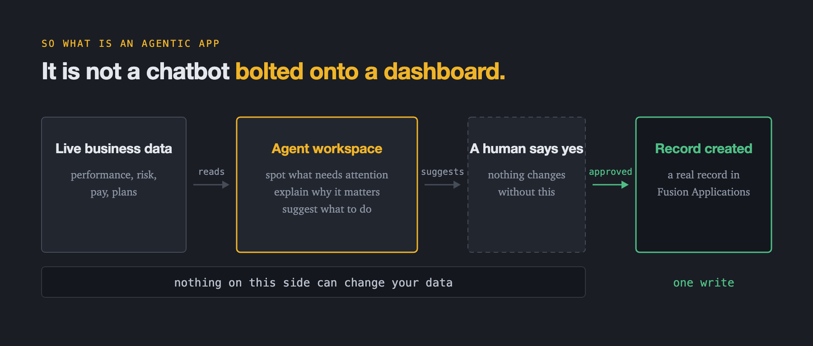

**It is not a chatbot bolted onto a dashboard.** The flow is: live business data → an agent workspace that spots what needs attention, explains why it matters, and suggests what to do → **a human says yes** → a real record is created in Fusion.

And note the line along the bottom: *nothing on this side can change your data.* The agent reads and reasons. Only a human approval turns that into a write.

### The four pillars

Every feature in an agentic app is one of these four:

| Pillar | What it does | How it appears |
| --- | --- | --- |
| **Information Displays** | Agent-generated visuals | Seven widget types via `<oraInfoDisplay>`. The agent produces structured metadata; Oracle renders it. The UI is never hardcoded. |
| **Actionable Insights** | Turns analysis into execution | Each insight has a Title, Description, and agent-generated Execution Instructions. The agent that created an action owns running it. |
| **Communications** | Outbound messaging | App-defined (template-based: PowerPoint, PDF, email, text) or agent-generated at runtime (email and text only). Always outbound — never intercepts incoming. |
| **Ask Oracle Advisors** | The conversational layer | Answers combine text with full information displays. In Section Focus it scopes to only the agents powering that section, so a domain expert answers rather than a generalist. |

All four, on one screen:

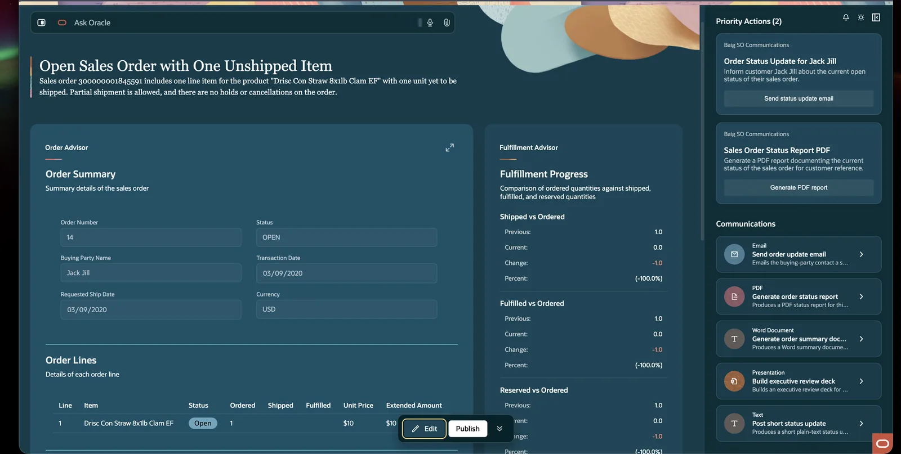

The left two columns are information displays. The panel on the right is the other two: **Priority
Actions** at the top (each one an actionable insight the agent raised, with the button that runs it)
and **Communications** below (email, PDF, Word, presentation, plain text). **Ask Oracle** sits across
the top.

### The seven widget types

| Widget | `patternId` | Best for |
| --- | --- | --- |
| Chart | `chartWidget` | Trends over time, category comparisons, proportions |
| Card | `cardWidget` | Single alerts, notifications, status with priority variants |
| Message List | `messageListWidget` | Ordered lists of messages or alerts with priority badges |
| Change List | `changeListWidget` | Before/after comparisons — current vs previous |
| Multi Record | `multiRecordWidget` | Tables with sortable columns, row actions, bulk operations |
| Record | `recordWidget` | A single record's details or key-value display |
| Sankey | `sankeyWidget` | Flow visualisation — how quantities move between stages |

Three of them in one panel — a change list for shipped-versus-ordered, a card for the exception, and
a footer of suggested actions:

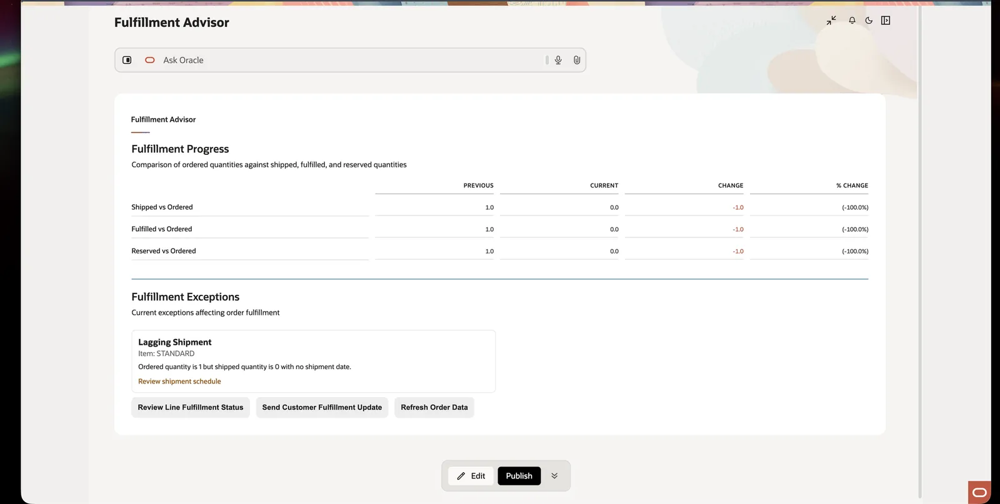

The agent did not write any of that markup. It produced structured metadata; Oracle rendered it with
its own components. That is why the app cannot draw something Oracle has not approved.

### The five-layer section structure

Every section in every agentic app follows the same shape. Users learn it once.

| Layer | Content | Example |
| --- | --- | --- |
| 1. Headline | The single most important insight | "3 supplier contracts expire this week" |
| 2. Short description | Why it matters, what triggered it | "AcmeParts has the highest renewal risk based on SLA trends" |
| 3. Content | Detail via widgets | Lists, tables, cards, forms |
| 4. Visualisations | Charts for trends and comparisons | Bar, pie, line, Sankey |
| 5. Footer | Sources plus suggested actions | `[ Take Action ] [ Details ]` |

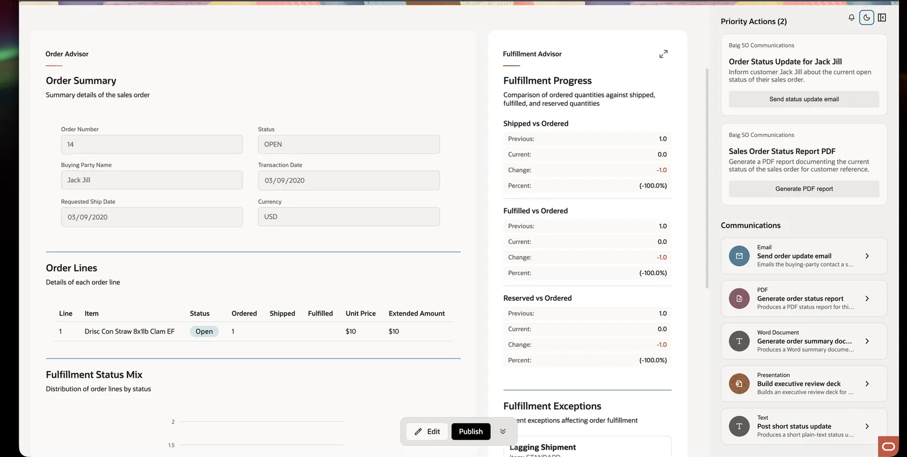

Headline, one line of why it matters, the detail, a chart, then the actions. Every panel, every app,
same shape.

### `$OraMessageHint` — how everything is triggered

This is the mechanism that makes the whole thing work. When something happens in an app, Oracle sends your workflow a value in `$context.$app.$OraMessageHint`, and your workflow branches on it — usually with a Switch node as the very first step.

**Phase 1 — five hints fire in parallel the moment the app loads:**

| Hint | What it asks for |
| --- | --- |
| `InitSubtitle` | The dynamic tagline — "Good morning, Meg." |
| `Summary` | A one- or two-sentence overview — "3 items need review." |
| `InitDisplay` | Render the widgets — charts, lists, cards |
| `InitActions` | The priority insights — approve, review, act |
| `InitCommunications` | Suggested messages — email, text, PDF |

They run in parallel, which is why a fully populated app appears in seconds.

**Phase 2 — user-driven events:**

| Hint | Fired when | Extra context it gets |
| --- | --- | --- |
| `Query` | Someone asks Ask Oracle a question | `$chatHistory` |
| `InvokeAction` | Someone clicks an action button | `$OraAction` |
| `FillParameters` | A communication needs auto-filling | `$OraCommsParamsToFill` |
| `SendCommunication` | A message is delivered | — |
| `AdditionalContent` | A panel asks for more | `$OraPanelName` |

### Workflow teams vs supervisor teams

| | **Workflow Teams** *(recommended)* | **Supervisor Teams** *(fallback)* |
| --- | --- | --- |
| Shape | Hint → Switch/Route → Agent → Structured output | Request → Supervisor picks workers → Workers |
| Routing | Structured, via `$OraMessageHint` | The supervisor decides at runtime |
| Latency | Predictable | Less predictable |
| Risk | Low | Can make excessive LLM calls |
| Use for | Production apps | Quick prototypes, edge cases |

Use workflows for production. Also worth knowing: **only published workflows get invoked**.

### The decisions that matter

| Decision | What to do |
| --- | --- |
| Team type | Workflow first. Supervisor only for dynamic multi-turn collaboration. |
| One agent or many | **Many, always.** Specialised agents per domain beat one generalist. |
| Team granularity | Break into smaller topic areas; combine at the app level. |
| Context passing | **Pass explicitly** via `$context.$system.$inputMessage`. Never assume it arrives on its own. |
| Terminal workflow paths | End with an Agent or LLM node, not Code or Output, so streaming works later. |
| Communication type | Templates for documents (PowerPoint, PDF); agent-generated for ad-hoc email and text. |
| Action invocation | `ora.Invoke()` for defined workflows; `ora.Agent()` for ad-hoc commands. |
| Drill-down navigation | `ora.App.launch()` or the Navigate to App action step. |
| **Response time** | **60-second hard limit.** Minimise LLM and Agent nodes. Test latency in Preview. |

That 60-second limit is the constraint that shapes everything else. It is why deterministic workflows beat improvising supervisors, and why the agent is stingy with LLM nodes.

---

## 11. Things that go wrong, and the fix

| Problem | What is happening | Fix |
| --- | --- | --- |
| Claude Code cannot see the skills | They are only in `.agents/skills/` | Do [Step 5](#step-5--make-claude-code-see-the-skills). Confirm with `ls -la .claude/skills`. |
| `AUTH_REQUIRED` in a JSON response | Your token expired or was never set | Do not treat that JSON as the answer. Run the `interactiveCommand` it returns in a real terminal, then retry. Never paste a raw password into a command. |
| Password prompt never appears | Some terminal UIs cannot show hidden prompts | Run `configure-basic-auth` in a real terminal, or authorise `--password-stdin` explicitly. Never write a password into `env.properties`. |
| The agent scaffolded a blank project | It ran `init` when it should not have | Put "Do NOT run `init` unless I explicitly ask" in `CLAUDE.md`. `init` is only for genuinely empty projects. |
| "This app has been modified on the server" | The server copy diverged from yours | **Refresh from Server** to take theirs, **Cancel** to think. Only **Override Server** if you are certain. |
| "found artifact files using legacy extensions" | You are on `.app`/`.dl`/`.approval`; newer is `.apps`/`.deeplink`/`.approvalProcess` | **Migrate** if you are starting fresh. **Skip** if existing tooling depends on the old names. |
| Agent asks which app package to use | You have more than one under `app-pkg/` | Name it in your request. The skill deliberately will not guess. |
| A `.wf` edit broke after a CLI command | Shell quoting ate an expression like `$context` or `{{...}}` | Use a file-backed patch: `--inputs-patch @.debug/my-inputs.json`. Then validate. |
| Workflow test says "remote judge" | A CI npm script leaked in | Never pass `--judge-provider remote` unless you mean it. Never use npm scripts for tests. |
| Agent will not publish a workflow | Correct behaviour | Publishing a workflow is deliberately UI-only. Do it in Fusion. |
| App runs slowly or times out | You are near the 60-second ceiling | Reduce LLM and Agent nodes. Run `analyze-token-usage`. Move logic into Code nodes. |

---

## 12. Keeping it up to date

Oracle ships updates to this repo. The change log at the top of the README tells you what moved.

Four folders, three of which get replaced:

| Folder | On update |
| --- | --- |
| `aiapps/` | **Replace** with the latest from the repo |
| `.agents/skills/aistudio/` | **Replace** |
| `.agents/skills/aistudio-apps-*/` | **Replace** all of them |
| `src/` | **Never touched.** This is your work. |

The routine:

```bash
# 1. get the latest
cd ~/fusion-ai-repo/fusion-ai-studio
git pull

# 2. replace the samples
rm -rf ~/fusion-ai-workspace/aiapps
cp -R release-26C/aiapps ~/fusion-ai-workspace/

# 3. replace the skills (unzip the new ones first)
rm -rf ~/fusion-ai-workspace/.agents/skills/aistudio
cp -R <newly-unzipped>/aistudio ~/fusion-ai-workspace/.agents/skills/

# 4. reinstall the extension from the new .vsix (Install from VSIX again)
```

If you used **symlinks** in Step 5, `.claude/skills/` picks the update up automatically. If you **copied**, re-copy now. This is the reason symlinks are worth the extra minute.

---

## The part that actually matters

Setup is maybe forty minutes. But the setup is not the interesting bit.

The interesting bit is that Oracle wrote down their own expertise as files a machine can read, and put a boundary between the AI and the running system. The AI writes files. Oracle checks the files. Oracle builds the screens. A human approves anything that changes a record.

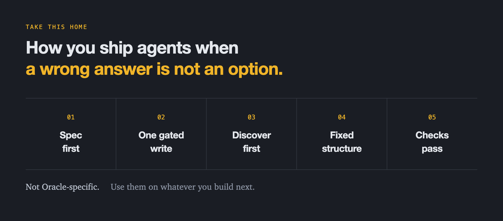

That is how you ship agents when a wrong answer is not an option. The spec comes first. One gated write action. Discover before you build. Structure over improvisation. Unvalidated means unfinished.

Those five rules are not Oracle-specific. Use them on whatever you build next.

---

### Links

- **Oracle's repo:** [github.com/oracle/fusion-ai-studio](https://github.com/oracle/fusion-ai-studio)
- **Oracle Fusion AI docs:** [docs.oracle.com/en/cloud/saas/fusion-ai/](https://docs.oracle.com/en/cloud/saas/fusion-ai/)
- **Oracle Fusion AI product page:** [oracle.com/applications/fusion-ai/](https://www.oracle.com/applications/fusion-ai/)
- **Claude Code:** [claude.com/claude-code](https://claude.com/claude-code)
- **In the repo:** `release-26C/how-to/install-and-use-fusion-ai-studio-CLI_vscode-codex.md`, `how-to-configure-oauth-for-aistudio-cli.md`, `how-to-uptake-incremental-updates.md`

*Tested against `release-26C`, CLI version `1.0.1784919021375`, 288 CLI commands, 3 skills, 30 prompt references, 27 node prompts.*
